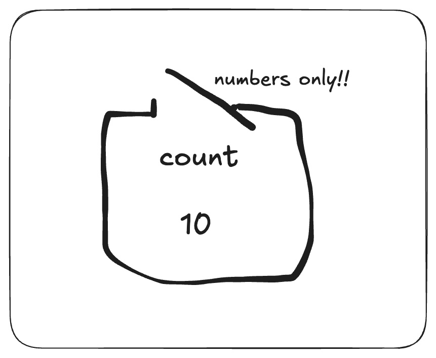

# Coding logic

At its heart, programming is about logic. You are telling the computer what to do, how to do it and when to do it.

Each programming language has its own syntax (the way you write things) but the underlying logic is often very similar.

This lesson is all about the basic building blocks of programming logic.

## Variables

Variables are like containers that hold information. You can think of them as labelled boxes where you can store data.

```typescript
let count: number = 10;
```

In this example, `count` is a variable that holds the number `10`.



The `let` keyword is used to declare a variable, and the `: number` part specifies that this variable will hold a number.

## Data Types

Data types define the kind of data a variable can hold. Common data types include:
- `number`: for numeric values (e.g., `10`, `3.14`)
- `string`: for text (e.g., `"Hello, World!"`)
- `boolean`: for true/false values (e.g., `true`, `false`
- `array`: for lists of values (e.g., `[1, 2, 3]`)
- `object`: for more complex data structures (e.g., `{ type: 'box', color: 'red' }`)

In Typescript, it is good practice to specify the data type of variable when you declare it.

However, TypeScript can often infer the type based on the value you assign to the variable.

```typescript
let count = 10;
```

So even without explicitly stating `: number`, TypeScript understands that `count` is a number.

### Practice

Try to write out the following variables with their types:
- A variable called `username` that holds a string value of your name.
- A variable called `isLoggedIn` that holds a boolean value indicating if a user is logged in.
- A variable called `scores` that holds an array of numbers representing game scores.
- An object called `car` that has properties for `make` (string), `model` (string), and `year` (number).

<details>
    <summary>Click to reveal answers</summary>

```typescript
let username: string = "Gloria";
let isLoggedIn: boolean = true;
let scores: number[] = [85, 90, 78];
let car: { make: string; model: string; year: number } = { make: "Toyota", model: "Corolla", year: 2020 };
```

</details>

Now you know how to declare variables, its time to do something with them!

## Operations

Operations are actions that you can perform on variables and values. Common operations include:
- Arithmetic operations: `+`, `-`, `*`, `/`
- Comparison operations: `===`, `!=`, `<`, `>`, `<=`, `>=`
- Logical operations: `&&` (AND), `||` (OR), `!` (NOT)

### Arithmetic Operations

Arithmetic operations are used to perform mathematical calculations.

```typescript
let x: number = 10;
let y: number = 5;
let a: number = x + y; 
let b: number = x - y;
let c: number = x * y;
```

What would be the value of `a`, `b`, and `c`?

<details>
    <summary>Click to reveal answers</summary>

- `a` would be `15`
- `b` would be `5`
- `c` would be `50`

</details>

### Comparison Operations

Comparison operations are used to compare two values.

```typescript
let x: number = 10;
let y: number = 5;
let a: boolean = x === y;
let b: boolean = x > y;
let c: boolean = x <= y;
let d: boolean = x = y;
```

What would be the value of `a`, `b`, `c` and `d`?

<details>
    <summary>Click to reveal answers</summary>

- `a` would be `false`
- `b` would be `true`
- `c` would be `false`
- `d` was a trick! It should be `x != y` to check for inequality.
  - `=` is an assignment operator, not a comparison operator.
  - So `d` would end up being assigned the value of `y`, which is `5`.

</details>

### Logical Operations

Logical operations are used to combine multiple conditions.

_Quick note: When you see a code block like the one below with two // characters (backslashes) 
it just represents comments in the code._

_They don't do anything and are for the benefit of the person reading the code._

```typescript
let isShape: boolean = true;
let isRed: boolean = false;
let a: boolean = isShape && isRed; // AND operation
let b: boolean = isShape || isRed;
let c: boolean = !isShape;
```

What would be the value of `a`, `b` and `c`?

<details>
    <summary>Click to reveal answers</summary>

- `a` would be `false` because both conditions need to be true for AND (`&&`) to return true.
- `b` would be `true` because at least one condition needs to be true for OR (`||`) to return true.
- `c` would be `false` because NOT (`!`) negates the value of `isShape`.

</details>

## Control Flow

Control flow determines the order in which code is executed based on conditions. 

Good programming relies heavily on control flow to make decisions and repeat actions.

Knowing when to use nested `if` statements versus returning early from a function is an important skill to develop.

But we'll cover that in later lessons, its just good to be aware of it now.

Common control flow statements include:
- `if`, `else if`, `else`
- `switch`
- Loops (`for`, `while`)

We will cover loops and switch statements in later lessons.

### If, Else If, Else

The `if` statement allows you to execute code based on a condition.

```typescript
let score: number // Leaving this unassigned for now;
let grade: string;
if (score >= 90) {
    grade = "A";
} else if (score >= 80) {
    grade = "B";
} else {
    grade = "C";
}
```

What would be the value of `grade` if `score` is `85`?

<details>
    <summary>Click to reveal answers</summary>

- `grade` would be `"B"` because `score` is greater than or equal to `80` but less than `90`.

</details>


Well done on getting through the basics of programming logic!

We will build on these concepts in future lessons.

