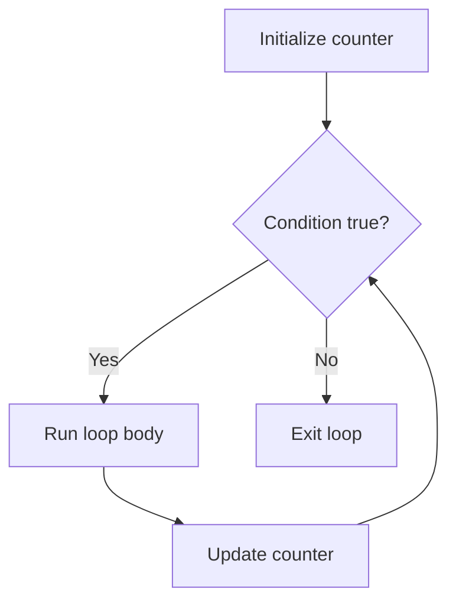
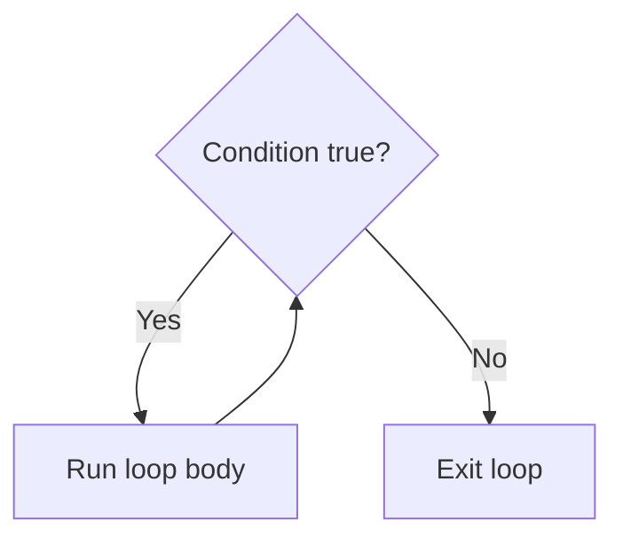

# Control flow: Loops and Switch

In lesson 001, we covered `if`, `else if`, and `else` for making decisions. Now we'll look at two more control flow tools: **loops** for repeating actions and **switch** for choosing between many options.

## For Loops

A `for` loop repeats a block of code a specific number of times.



```typescript
for (let i = 0; i < 5; i++) {
    console.log(i);
}
```

The `for` loop has three parts inside the parentheses:

1. **Initializer**: `let i = 0` — runs once before the loop starts
2. **Condition**: `i < 5` — checked before each iteration; the loop stops when this is `false`
3. **Update**: `i++` — runs after each iteration

So this loop prints `0`, `1`, `2`, `3`, `4` and then stops because `i` reaches `5`.

### Looping through arrays

A common use for `for` loops is going through each item in an array:

```typescript
let colors: string[] = ["red", "green", "blue"];
for (let i = 0; i < colors.length; i++) {
    console.log(colors[i]);
}
```

`colors.length` is `3`, so `i` goes from `0` to `2`, which matches the array indices.

### Practice

What does this loop print?

```typescript
for (let i = 2; i <= 8; i += 2) {
    console.log(i);
}
```

<details>
    <summary>Click to reveal answer</summary>

It prints `2`, `4`, `6`, `8`. It starts at 2 and goes up by 2 each time. When `i` reaches `10`, the condition `i <= 8` is false, so the loop stops.

</details>

What does this loop print?

```typescript
for (let i = 3; i > 0; i--) {
    console.log(i);
}
```

<details>
    <summary>Click to reveal answer</summary>

It prints `3`, `2`, `1`. The loop counts down using `i--`. When `i` reaches `0`, the condition `i > 0` is false, so the loop stops.

</details>

## While Loops

A `while` loop repeats as long as a condition is `true`. Use it when you don't know in advance how many times you need to loop.



```typescript
let count: number = 0;
while (count < 3) {
    console.log(count);
    count++;
}
```

This prints `0`, `1`, `2`. The condition is checked **before** each iteration, so if it starts `false`, the body never runs.

### Practice

What does this loop print?

```typescript
let x: number = 1;
while (x < 20) {
    x = x * 2;
}
console.log(x);
```

<details>
    <summary>Click to reveal answer</summary>

It prints `32`. The value doubles each time: 1 → 2 → 4 → 8 → 16 → 32. When `x` reaches 32, the condition `x < 20` is false, so the loop stops. The `console.log` is **outside** the loop, so it only prints the final value.

</details>

### Infinite loops

Be careful with `while` loops. If the condition never becomes `false`, the loop runs forever:

```typescript
// DON'T DO THIS — infinite loop!
let n: number = 1;
while (n > 0) {
    n++;
}
```

Always make sure something inside the loop moves you closer to the condition becoming `false`.

## Do...While Loops

A `do...while` loop is like a `while` loop, but it always runs the body **at least once** before checking the condition.

```typescript
let attempts: number = 0;
do {
    attempts++;
    console.log("Attempt " + attempts);
} while (attempts < 3);
```

This prints `"Attempt 1"`, `"Attempt 2"`, `"Attempt 3"`.

The difference from a regular `while` loop: even if the condition is `false` from the start, the body still runs once.

```typescript
let x: number = 10;
do {
    console.log(x);
} while (x < 5);
```

What does this print?

<details>
    <summary>Click to reveal answer</summary>

It prints `10`. The body runs once, printing `x`. Then the condition `x < 5` is checked — it's `false`, so the loop stops after one iteration.

A regular `while (x < 5)` loop would print nothing because the condition is already false.

</details>

If you've seen other languages that have an `until` loop (repeat **until** something is true), `do...while` is the TypeScript equivalent — you just write the condition as the opposite. For example, "repeat until `done` is true" becomes `do { ... } while (!done)`.

## Break and Continue

Two keywords let you control loops from the inside:

- `break` — stops the loop entirely
- `continue` — skips the rest of the current iteration and moves to the next one

```typescript
for (let i = 0; i < 10; i++) {
    if (i === 5) {
        break;
    }
    console.log(i);
}
// Prints: 0, 1, 2, 3, 4
```

```typescript
for (let i = 0; i < 5; i++) {
    if (i === 2) {
        continue;
    }
    console.log(i);
}
// Prints: 0, 1, 3, 4
```

These work in both `for` and `while` loops.

### Practice

What does this code print?

```typescript
let numbers: number[] = [10, 20, 30, 40, 50];
let total: number = 0;
for (let i = 0; i < numbers.length; i++) {
    if (numbers[i] === 30) {
        continue;
    }
    total = total + numbers[i];
}
console.log(total);
```

<details>
    <summary>Click to reveal answer</summary>

It prints `120`. The loop adds all numbers except 30: 10 + 20 + 40 + 50 = 120.

</details>

What does this code print?

```typescript
let i: number = 0;
while (i < 10) {
    i++;
    if (i % 2 !== 0) {
        continue;
    }
    console.log(i);
}
```

<details>
    <summary>Click to reveal answer</summary>

It prints `2`, `4`, `6`, `8`, `10`. The `continue` skips odd numbers (where `i % 2 !== 0`), so only even numbers are printed. Note that `i++` is before the `continue`, so the counter always increments.

</details>

## Switch Statements

A `switch` statement is a clean way to handle many possible values for a single variable. It's an alternative to long `if / else if / else` chains.

```typescript
let day: string = "Monday";
let type: string;

switch (day) {
    case "Saturday":
    case "Sunday":
        type = "Weekend";
        break;
    case "Monday":
    case "Tuesday":
    case "Wednesday":
    case "Thursday":
    case "Friday":
        type = "Weekday";
        break;
    default:
        type = "Unknown";
        break;
}
```

Key rules:

- Each `case` compares the value using strict equality (`===`)
- `break` stops the switch from falling through to the next case
- `default` handles any value not matched by a case
- Multiple cases can share the same code block (like "Saturday" and "Sunday" above)

### What happens without break?

Without `break`, execution "falls through" to the next case:

```typescript
let fruit: string = "apple";

switch (fruit) {
    case "apple":
        console.log("Found apple");
    case "banana":
        console.log("Found banana");
        break;
    case "cherry":
        console.log("Found cherry");
        break;
}
```

What does this print?

<details>
    <summary>Click to reveal answer</summary>

It prints both `"Found apple"` and `"Found banana"`. Because the `"apple"` case has no `break`, execution falls through into the `"banana"` case.

</details>

### When to use switch vs if/else

- Use `switch` when comparing **one variable** against **many specific values**
- Use `if/else` when conditions involve **ranges**, **multiple variables**, or **complex logic**

### Practice

What does `result` end up being?

```typescript
let status: number = 404;
let result: string;

switch (status) {
    case 200:
        result = "OK";
        break;
    case 404:
        result = "Not Found";
        break;
    case 500:
        result = "Server Error";
        break;
    default:
        result = "Unknown Status";
        break;
}
```

<details>
    <summary>Click to reveal answer</summary>

`result` is `"Not Found"`. The switch matches `status` to the `case 404` block.

</details>

## Wrapping Up

You now have the full set of basic control flow tools:

- `if / else if / else` for decisions (lesson 001)
- `for` and `while` loops for repetition
- `do...while` for "run at least once" situations
- `switch` for choosing between many specific values
- `break` and `continue` for fine-tuning loop behavior

These building blocks appear in nearly every program you'll write.
