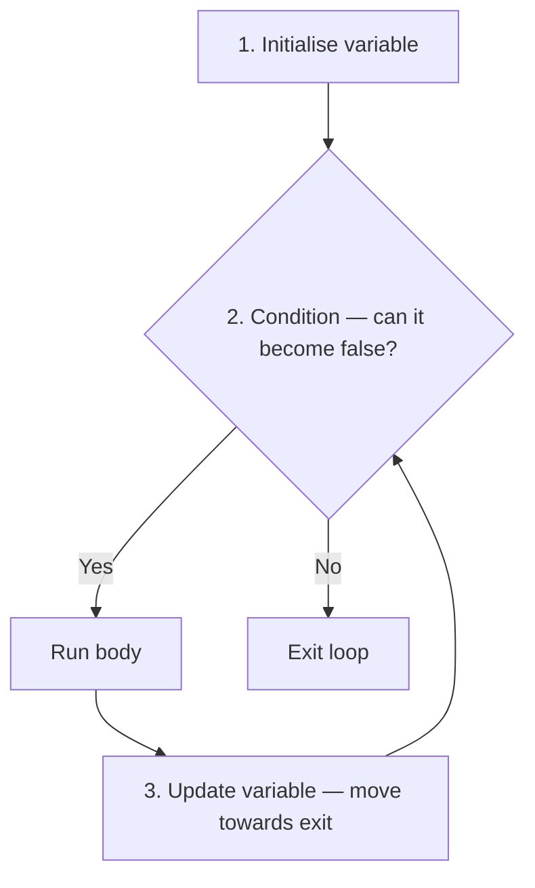

# Reinforcement: Tracing, Expressions, and While Loops

Before we move on to new topics, this lesson revisits a few concepts from lesson 002 that need extra practice. Being able to trace code carefully, understand what each line *does*, and write correct `while` loops are skills you'll rely on in every future lesson.

## Expressions vs Statements

This is one of the most important distinctions in programming, and getting it wrong causes silent bugs — code that runs without errors but doesn't do what you expect.

An **expression** produces a value:

```typescript
5 + 3          // produces 8
i % 2 === 0    // produces true or false
"hello".length // produces 5
```

A **statement** performs an action — it *does* something:

```typescript
let x: number = 5;    // creates a variable
x = x + 1;            // changes a variable
console.log(x);        // prints output
```

### The silent bug

What does this line do?

```typescript
i % 2 === 0;
```

**Nothing.** It calculates whether `i` is even, gets `true` or `false`… and throws the result away. There's no assignment, no `if`, no `console.log` — so the result is lost. TypeScript won't give you an error; the line just silently does nothing.

Compare these two lines:

```typescript
i % 2 === 0;    // ❌ calculates true/false, then throws it away
i += 2;         // ✅ actually changes i
```

### `=` vs `===`

These two operators look similar but do completely different things:

- `=` is **assignment** — it changes a value: `x = 10;`
- `===` is **comparison** — it checks whether two values are equal: `x === 10`

A common mistake:

```typescript
// Bug: this SETS x to 10, it doesn't check if x is 10
if (x = 10) {
    console.log("x is ten");
}

// Correct: this CHECKS if x is 10
if (x === 10) {
    console.log("x is ten");
}
```

### Quick rule

Ask yourself: **"Does this line change something or print something?"** If the answer is no, the line probably isn't doing what you think.

### Practice

Which of these lines actually *do* something, and which do nothing?

```typescript
let score: number = 0;     // Line 1
score + 10;                 // Line 2
score = score + 10;         // Line 3
score === 10;               // Line 4
console.log(score);         // Line 5
```

<details>
    <summary>Click to reveal answer</summary>

- Line 1: ✅ Does something — declares a variable and sets it to `0`.
- Line 2: ❌ Does nothing — calculates `0 + 10 = 10` and throws the result away. `score` is still `0`.
- Line 3: ✅ Does something — calculates `0 + 10` and *assigns* it back to `score`. Now `score` is `10`.
- Line 4: ❌ Does nothing — checks whether `score` equals `10` (it does), but doesn't use the result anywhere.
- Line 5: ✅ Does something — prints `10`.

</details>

## Code Tracing — The Variable Table

When a question asks "what does this code print?", the safest approach is to **trace it line by line** using a variable table. This means writing down the value of every variable at each step.

### Worked example

What does this code print?

```typescript
let n: number = 64;
while (n > 1) {
    n = n / 2;
    console.log(n);
}
```

Build a table — one column per variable, one row per step:

| Step | `n`  | Condition `n > 1` | Output |
| ---- | ---- | ------------------ | ------ |
| Init | 64   | —                  | —      |
| 1    | 32   | 64 > 1 → true     | 32     |
| 2    | 16   | 32 > 1 → true     | 16     |
| 3    | 8    | 16 > 1 → true     | 8      |
| 4    | 4    | 8 > 1 → true      | 4      |
| 5    | 2    | 4 > 1 → true      | 2      |
| 6    | 1    | 2 > 1 → true      | 1      |
| —    | 1    | 1 > 1 → false     | (stop) |

**Output:** `32`, `16`, `8`, `4`, `2`, `1`.

Notice that the division happens *before* the print. So the first output is `32`, not `64`. You can only see this if you trace line by line — guessing from a quick glance gives the wrong answer.

### The order matters

The most common tracing mistake is getting the order of operations wrong within the loop body. Compare:

```typescript
// Version A: change THEN print
let i: number = 5;
while (i > 0) {
    i--;
    console.log(i);
}
// Prints: 4, 3, 2, 1, 0
```

```typescript
// Version B: print THEN change
let i: number = 5;
while (i > 0) {
    console.log(i);
    i--;
}
// Prints: 5, 4, 3, 2, 1
```

Same loop structure, same condition, different output — because the order of the two lines in the body is swapped.

### Practice

Trace this code using a variable table. What does it print?

```typescript
let x: number = 1;
for (let i = 0; i < 4; i++) {
    x = x * 2;
}
console.log(x);
```

<details>
    <summary>Click to reveal answer</summary>

| Step | `i` | Condition `i < 4` | `x` |
| ---- | --- | ------------------ | --- |
| Init | 0   | —                  | 1   |
| 1    | 0   | 0 < 4 → true      | 2   |
| 2    | 1   | 1 < 4 → true      | 4   |
| 3    | 2   | 2 < 4 → true      | 8   |
| 4    | 3   | 3 < 4 → true      | 16  |
| —    | 4   | 4 < 4 → false     | —   |

It prints `16`. The `console.log` is outside the loop, so only the final value is printed.

</details>

## While Loops — Getting Them Right

A `while` loop has three essential parts. If any one is missing, the loop is broken:



1. **Initialise** a variable before the loop
2. **Condition** that will eventually become `false`
3. **Update** the variable inside the body so it moves towards the exit

### Checklist for every while loop

Before you write a `while` loop, ask yourself these three questions:

1. ✅ **Did I create the variable before the loop?**
2. ✅ **Will the condition eventually become `false`?**
3. ✅ **Does the body actually change the variable?**

If the answer to any of these is "no", you have a bug.

### Common mistake 1: condition goes the wrong way

```typescript
// ❌ BUG: i starts at 10, condition is i <= 10, and i decreases — always true!
let i: number = 10;
while (i <= 10) {
    console.log(i);
    i--;
}
```

The condition `i <= 10` is *always* true because `i` starts at 10 and only gets smaller. This runs forever.

**Fix:** The condition should check the *lower* bound when counting down:

```typescript
// ✅ FIXED
let i: number = 10;
while (i >= 1) {
    console.log(i);
    i--;
}
```

### Common mistake 2: body doesn't change the variable

```typescript
// ❌ BUG: the body never changes i
let i: number = 2;
while (i <= 20) {
    i % 2 === 0;     // this does nothing!
    console.log(i);
}
```

The line `i % 2 === 0;` is an expression, not a statement — it doesn't change `i`. So `i` stays at `2` forever.

**Fix:** Replace the expression with an actual update:

```typescript
// ✅ FIXED
let i: number = 2;
while (i <= 20) {
    console.log(i);
    i += 2;
}
```

### Common mistake 3: update in the wrong place

```typescript
// Prints 9 down to 0 — not 10 down to 1
let i: number = 10;
while (i >= 1) {
    i--;              // decrement BEFORE print
    console.log(i);
}
```

Because `i--` happens before `console.log`, the first output is `9`, not `10`. If you want `10` down to `1`, print first:

```typescript
// ✅ Prints 10 down to 1
let i: number = 10;
while (i >= 1) {
    console.log(i);   // print BEFORE decrement
    i--;
}
```

### Practice

What's wrong with this loop? How would you fix it?

```typescript
let count: number = 1;
while (count !== 10) {
    count += 3;
    console.log(count);
}
```

<details>
    <summary>Click to reveal answer</summary>

Trace it: `count` starts at 1. Body: `count += 3` makes it 4, print 4. Then 7, print 7. Then 10, print 10. Condition `count !== 10` is now `false`, so the loop stops.

It prints `4`, `7`, `10` — this loop actually works! But it's **fragile**. If you changed the increment to `+4`, `count` would go 1 → 5 → 9 → 13 and skip right past 10, looping forever.

The fix: use `count < 10` or `count <= 10` instead of `count !== 10`. Using `<` or `<=` is safer because it catches the variable even if it overshoots the exact target value.

</details>

## Writing Complete Code

When you write code as an answer, it needs to be **complete and runnable**. That means:

1. **Declare all variables** before using them
2. **Include the full loop body** with braces `{ }`
3. **Include the output** (`console.log`)

### Incomplete vs complete

❌ **Incomplete** — this isn't runnable:

```typescript
for (let i = 1; i <= 10; i++)
```

✅ **Complete** — this runs and produces output:

```typescript
for (let i = 1; i <= 10; i++) {
    console.log(i);
}
```

### Template for while loops

When writing a `while` loop answer, follow this template:

```typescript
// 1. Declare and initialise
let variableName: type = startValue;

// 2. Loop with condition
while (condition) {
    // 3. Do something (print, accumulate, etc.)
    console.log(variableName);

    // 4. Update the variable
    variableName = newValue;
}
```

### Template for accumulator patterns

Many problems ask you to calculate a total, count, or find a value. This pattern appears constantly:

```typescript
let result: number = 0;                    // accumulator starts at 0
for (let i = 0; i < items.length; i++) {
    result = result + items[i];            // build up the result
}
console.log(result);                       // print AFTER the loop
```

The key: declare the accumulator *before* the loop, update it *inside* the loop, and print it *after* the loop.

## Wrapping Up

This lesson covered four ideas to keep in mind as you write more code:

1. **Expressions vs statements** — if a line doesn't assign, print, or change something, it probably does nothing
2. **Code tracing** — use a variable table to step through code line by line; don't guess
3. **While loops** — always check: did I initialise? Will the condition become false? Does the body update the variable?
4. **Complete code** — always write the full program: declarations, body with braces, and output
